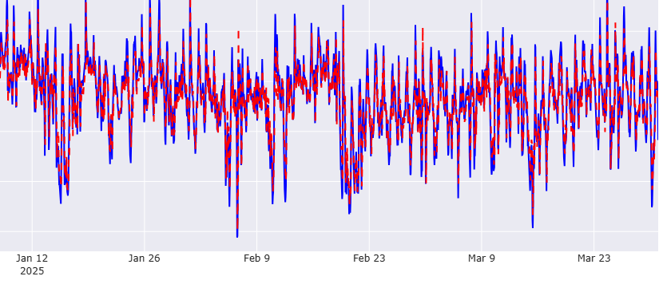

# ERCOT Far West Electricity Demand Forecasting (LSTM)

**Predicción horaria de demanda energética en la zona Far West del estado de Texas usando redes neuronales recurrentes (RNN)**  

## Descripción del Proyecto y Objetivos
Este proyecto se centra en predecir la demanda energética horaria (en MWh) de la región Far West de Texas (FWES) de ERCOT utilizando redes neuronales recurrentes (RNN). En especifico, se hará uso de LSTM (Long Short-Term Memory).

El objetivo es optimizar la generación de energía para evitar sobrecostos y mejorar la eficiencia en la gestión de la red eléctrica, dado el alto grado de penetración de energías renovables y la volatilidad extrema de la demanda y generación. Usando datos históricos horarios del 2019 al 2024 y evaluando su desempeño en el primer trimestre de 2025.

## ¿Por qué Far West?
La región de Far West Texas es una de las más relevantes en términos de generación de energía eólica (energías renovables) y presenta una alta volatilidad en la demanda y generación. Por ello, la predicción precisa de la demanda es importante para evitar cuellos de botella en la transmisión y optimizar la generación de energía.

## Estructura del Proyecto
*   **`Images`**: Capeta que contiene imagenes utilizadas en este archivo README.
*   **`LSTM.ipynb`**: El código principal del modelo de predicción utilizando LSTM.
*   **`requirements.txt`**: Lista de dependencias necesarias para ejecutar el proyecto.
*   **`README.md`**: Este archivo, que explica cómo ejecutar el proyecto y qué hace.

## Descripción de los Datos

Los datos utilizados en este proyecto provienen de la **región Far West de Texas (FWES)** dentro de **ERCOT (Electric Reliability Council of Texas)**, específicamente de la demanda de energía eléctrica horaria. La región de FWES es conocida por su alta penetración de energías renovables, principalmente eólica, y presenta una volatilidad extrema tanto en la demanda como en la generación de electricidad.

### Fuentes de Datos

Los datos se obtienen de la **U.S. Energy Information Administration (EIA)** y están disponibles en formato CSV. Estos datos incluyen:

| **period**     | **subba** | **subba-name**  | **parent** | **parent-name**                                      | **value** | **value-units** |
|-----------------|-----------|-----------------|------------|------------------------------------------------------|-----------|---------------------|
| 2025-04-09T05  | FWES      | Far West        | ERCO       | Electric Reliability Council of Texas, Inc.          | 7611      | megawatthours        |
| 2025-04-09T04  | FWES      | Far West        | ERCO       | Electric Reliability Council of Texas, Inc.          | 7274      | megawatthours        |
| 2025-04-09T03  | FWES      | Far West        | ERCO       | Electric Reliability Council of Texas, Inc.          | 6986      | megawatthours        |
| 2025-04-09T02  | FWES      | Far West        | ERCO       | Electric Reliability Council of Texas, Inc.          | 6938      | megawatthours        |

- **period**: Fecha y hora de la medición de la demanda energética (formato ISO 8601).
- **subba**: Identificador de la subregión (en este caso, filtrado solo a datos con "FWES", que corresponde a Far West de Texas).
- **subba-name**: Nombre de la subregión ("Far West").
- **parent**: Identificador de la organización a nivel superior (filtrado solo a datos "ERCO").
- **parent-name**: Nombre de la organización superior.
- **value**: La cantidad de **demanda de energía** (valor numerico).
- **value-units**: La unidad de medida para la demanda energética, la cual es **megavatios hora (MWh)**.

### Datasets

Se utilizaron los siguientes conjuntos de datos para el entrenamiento y evaluación del modelo:

- **Datos de entrenamiento**: `ercot_fwes_complete_2019-2025.csv` - Este conjunto de datos fue utilizado para entrenar el modelo LSTM. Contiene la demanda horaria de energía eléctrica en la región de Far West de Texas, con datos históricos desde 2019 hasta el 31 de diciembre de 2024.
  
- **Datos de evaluación**: `ercot_fwes_010125-033125.csv` - Este conjunto de datos se utilizó para evaluar el desempeño del modelo. Incluye los registros de la demanda horaria de energía para el primer trimestre de 2025, lo que permitió comprobar la capacidad predictiva del modelo.

### Preprocesamiento

Los datos han sido preprocesados de la siguiente manera:
- Eliminación de columnas no relevantes para el analisis. Solo se trabajó con las columnas de **period** y **value**.
- Normalización de los valores de la demanda utilizando **MinMaxScaler**.
- Creación de secuencias temporales para la entrada del modelo LSTM.
- División en conjuntos de entrenamiento y prueba para evaluar la capacidad del modelo.

Estos datos serán utilizados para entrenar un modelo LSTM que prediga la demanda futura de energía en función de patrones históricos.

## Implementación del Modelo LSTM

### ¿Por qué LSTM?

El modelo **LSTM (Long Short-Term Memory)** es una variante avanzada de las Redes Neuronales Recurrentes (RNNs), diseñadas para trabajar con datos secuenciales. Mientras que las redes neuronales tradicionales (como las RNN) tienen dificultades para aprender dependencias de largo plazo debido al problema del desvanecimiento del gradiente, los LSTM incluyen capas de memoria que permiten almacenar información por periodos más largos. Esto resulta útil para tareas de predicción que dependen de patrones temporales complejos, como en el caso de la predicción de la demanda energética.

La demanda energética es una secuencia temporal y está influenciada por una serie de factores que cambian con el tiempo, como el horario, las estaciones del año, e incluso eventos climáticos inesperados. Capturar estas dependencias a largo plazo es esencial para hacer predicciones precisas. Los modelos LSTM, con una capacidad para recordar y olvidar información de manera selectiva, son ideales para aplicarlos a este tipo de problemas.

### Implementando el modelo al código

En el proyecto, implementamos un modelo LSTM para predecir la demanda horaria de energía eléctrica en la región de Far West de Texas, que es conocida por su alta penetración de energías renovables y su volatilidad energética. Para ello, preparamos los datos en secuencias de tiempo y los utilizamos para entrenar el modelo LSTM.

### Características clave de la implementación

1. **Preparación de los datos**: Los datos de consumo energético fueron normalizados utilizando MinMaxScaler para garantizar que las características estuvieran en un rango adecuado para el entrenamiento del modelo. Luego, convertimos los datos en secuencias, lo que permite que el modelo aprenda patrones temporales de la demanda energética.

2. **Modelo LSTM**: Se construyó una red LSTM utilizando Keras para predecir el consumo de energía en función de los datos históricos. La arquitectura de la red incluye capas LSTM seguidas de capas densas.

3. **Optimización con Adam**: El modelo fue optimizado usando el **optimizador Adam**, que es altamente efectivo para redes neuronales debido a su capacidad para adaptar la tasa de aprendizaje de cada parámetro durante el entrenamiento. Esto mejora la convergencia y permite que el modelo aprenda de manera más eficiente. Adam combina las ventajas de otros optimizadores como **RMSprop** y **Momentum**, y es particularmente útil cuando se trabaja con grandes cantidades de datos y modelos complejos como los LSTM.

4. **Detención temprana (Early Stopping)**: Para evitar el sobreajuste (overfitting) y mejorar la generalización del modelo, implementamos una técnica de **detención temprana**. Esta técnica revisa el rendimiento del modelo en un conjunto de validación y detiene el entrenamiento si no se observa mejora después de un número determinado de epochs. Esto ayuda a optimizar el tiempo de entrenamiento y evita que el modelo se ajuste demasiado a los datos de entrenamiento (overfitting).

5. **Guardado del mejor modelo**: Durante el entrenamiento, el modelo con el mejor rendimiento en el conjunto de validación se guardó de forma automática. Esto asegura que, incluso si el rendimiento del modelo disminuye después de cierto punto, se puede recuperar la mejor versión del modelo entrenado.

### LSTM y los optimizadores

El uso de **LSTM** es muy importante ante la tarea de predicción de demanda energética debido a la naturaleza secuencial y temporal de los datos. La capacidad de LSTM para capturar dependencias lo convierte en el modelo adecuado para manejar la complejidad de la demanda energética, donde los patrones de consumo pueden variar significativamente a lo largo de semanas o incluso meses.

El optimizador **Adam** se eligió por su eficiencia en problemas de optimización complejos. Dado que los datos de series temporales son altamente volátiles y pueden presentar grandes fluctuaciones, Adam permite que el modelo se entrene de manera más estable y eficiente, ajustando automáticamente la tasa de aprendizaje para cada parámetro durante el proceso de entrenamiento.

## Resultados

Una vez entrenado, el modelo LSTM fue capaz de predecir con mayor precisión la demanda energética futura, lo que es ser de suma importancia para mejorar la gestión de la generación de energía y optimizar los costos en un entorno con alta penetración de energías renovables. Las predicciones del modelo permiten ajustar las decisiones operativas en tiempo real, evitando la sobrecarga de la red.

La implementación del modelo LSTM con optimizadores y técnicas de regularización como la detención temprana y el guardado del mejor modelo, proporciona una solución robusta y eficiente para la predicción de la demanda energética en entornos complejos y volátiles.

